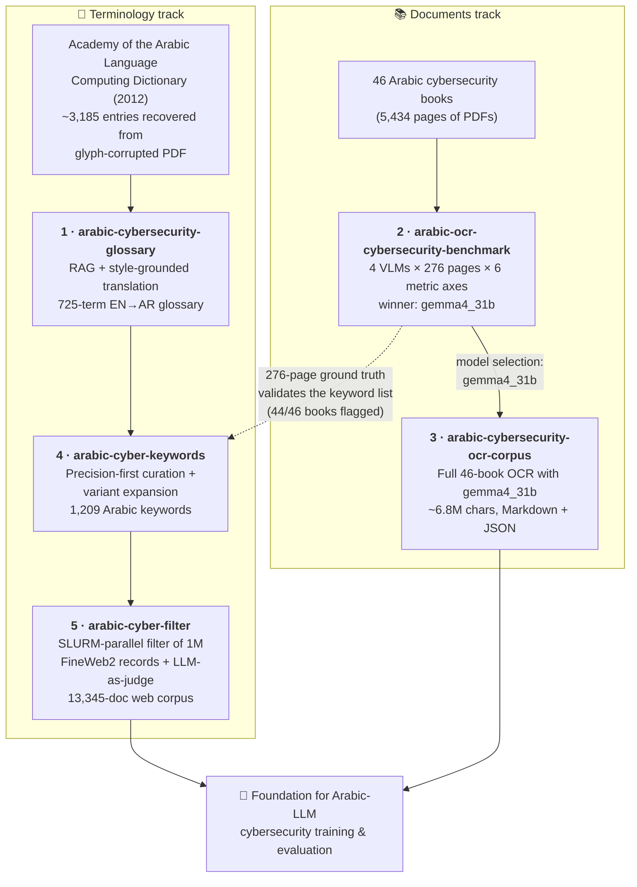

# Arabic Cybersecurity NLP — QCRI Summer Program 2026 🛡️

**The hub repository for everything I built during the Summer Program 2026: Cybersecurity at the Qatar Computing Research Institute (QCRI), HBKU.**


**Author:** Osamah Alsumaitti
**Supervisors:** Dr. Yazan Boshmaf · Dr. Mohannad Alhanahnah
**Institution:** Qatar Computing Research Institute (QCRI), Hamad Bin Khalifa University

---

## The mission

Arabic is a low-resource language for cybersecurity NLP: there is no standardized Arabic security terminology, no large open Arabic cybersecurity corpus, and no established benchmark for OCR of Arabic technical documents. Over the program I built, end-to-end, the missing pieces — **a standards-grounded terminology, a high-precision keyword lexicon, a validated OCR pipeline, a 46-book full-text corpus, and a 13,345-document web corpus** — each project deliberately consuming the verified output of the one before it.

The end state: **two complementary Arabic cybersecurity text corpora** (books + web) plus the reusable terminology and tooling that produced them, all intended as a foundation for training and evaluating Arabic language models in the cybersecurity domain.

## The five repositories

| # | Repository | One-liner | Key deliverable |
|---|---|---|---|
| 1 | [arabic-cybersecurity-glossary](https://github.com/Alsumaitti/arabic-cybersecurity-glossary) | Standards-grounded EN→AR cybersecurity terminology via RAG over the Academy of the Arabic Language dictionary | **725-term** bilingual glossary, zero gaps |
| 2 | [arabic-ocr-cybersecurity-benchmark](https://github.com/Alsumaitti/arabic-ocr-cybersecurity-benchmark) | Head-to-head evaluation of 4 vision-language OCR models on Arabic cybersecurity books | **276-page** benchmark; **gemma4_31b** selected |
| 3 | [arabic-cybersecurity-ocr-corpus](https://github.com/Alsumaitti/arabic-cybersecurity-ocr-corpus) | Full-text OCR of 46 Arabic cybersecurity books using the benchmark winner | **5,434 pages / ~6.8M chars** in Markdown + JSON |
| 4 | [arabic-cyber-keywords](https://github.com/Alsumaitti/arabic-cyber-keywords) | Precision-first Arabic cybersecurity keyword lexicon built from the glossary | **1,209 keywords** covering both translation styles |
| 5 | [arabic-cyber-filter](https://github.com/Alsumaitti/arabic-cyber-filter) | Keyword filtering of 1M FineWeb2 records + LLM-as-judge evaluation | **13,345-document** explainable web corpus, measured P/R/F1 |

## How everything connects

This is not five isolated projects — it is one research effort in which every stage compounds on the previous one. Two tracks (terminology and documents) run in parallel, cross-validate each other, and converge on the same goal.



The load-bearing links:

- **Glossary → Keywords.** The 725 verified term pairs are the seed vocabulary of the keyword lexicon; the "common translation" mapping (305 of 725 terms differ between classical and modern style) exists precisely because the glossary exposed the two-register problem.
- **Keywords → Filter.** The web-corpus filter does not invent its lexicon — it consumes the 1,209-keyword deliverable as-is, and its LLM-as-judge layer then *measures* how well that lexicon performs at corpus scale.
- **Benchmark → OCR corpus.** The production OCR run doesn't guess a model; `gemma4_31b` was selected by a six-axis evaluation with significance testing, and the hardened OCR prompt was carried over from the benchmark's failure analysis.
- **Cross-track validation.** The benchmark's 276-page ground truth doubled as the keyword list's validation set (44/46 books flagged, the 2 misses being a mojibake page and a nearly-all-English page) — the documents track quality-checking the terminology track.

## What I did, project by project

### 1 · Standards-grounded glossary — [arabic-cybersecurity-glossary](https://github.com/Alsumaitti/arabic-cybersecurity-glossary)

The terminology foundation. Instead of free translation, every Arabic rendering is grounded in the Academy of the Arabic Language (Cairo) *Computing Dictionary*, 4th ed.

- **Rescued the source itself:** the dictionary PDF had glyph-level font-encoding corruption; I built a normalization pipeline (deterministic de-corruption rules, wordlist + frequency disambiguation, dynamic-programming re-segmentation) that recovered **~3,185 clean entries at ~99.6% token validity**.
- **Built a RAG system** over the recovered entries (SQLite FTS5, BM25 search, context builder) and **codified the Academy's translation style** — derivation templates, fixed backbone terms, definition structure — into an explicit style guide.
- **Translated all 725 cybersecurity terms** with zero gaps: dictionary-covered terms reused verbatim, modern terms (AI/LLM, cloud) derived *by analogy to the Academy's own morphological patterns* and flagged `derived` vs `authoritative`, so every term's provenance is auditable.

### 2 · OCR model selection — [arabic-ocr-cybersecurity-benchmark](https://github.com/Alsumaitti/arabic-ocr-cybersecurity-benchmark)

A real end-to-end model-selection study on one hard corpus, before committing ~30 GPU-hours to production OCR.

- Distilled 46 books (5,434 pages) to a **276-page benchmark** — 6 most-informative pages per book, chosen by content-type heuristics plus a vision-LLM judge, exercising tables, figures, formulas, and blank pages.
- Ran **4 vision-language models on an NVIDIA H200** under identical conditions and scored them on **six axes** (CER/WER, chrF, table cell-F1, hallucination, robustness, efficiency) **plus a security-specific IOC layer** (exact-match recall/precision on CVEs, IPs, hashes) — because a reversed IP address or hash is silently, plausibly wrong.
- Verdict: **gemma4_31b** — best core-text accuracy (16.3% CER, 89.3% chrF), decisively best table structure (69.3% cell-F1), safest failure modes. Tie-broken via win-rate matrix and paired bootstrap test.
- Wrote the full report in **both English and Arabic**, a challenge log of everything that went wrong, and a Markdown-output follow-up experiment with side-by-side visual comparison — plus an openly stated validity caveat (the ground truth is model-made and lightly reviewed, not gold human transcription).

### 3 · The book corpus — [arabic-cybersecurity-ocr-corpus](https://github.com/Alsumaitti/arabic-cybersecurity-ocr-corpus)

The benchmark's conclusion, executed at scale.

- OCR'd **all 46 books — 5,434 pages, ~6.8M characters — in ~29.5 GPU-hours** on H200, one SLURM array task per book, resumable, with dual Markdown + page-level JSON output and a machine-readable manifest.
- Engineered the OCR prompt line-by-line against observed Arabic-technical-document failure modes: the **RTL/LTR directionality rule** (an IP printed `192.168.1.1` must never come back as `1.1.168.192`), strict GitHub-flavored-Markdown table serialization, anti-hallucination fences, and a `[BLANK]` sentinel.
- Built defensive decoding: dual-signal blank-page triage (text layer + pixel density), greedy decoding, and a 5-gram repetition guard with automatic `repetition_penalty` retry escalation.

### 4 · The keyword lexicon — [arabic-cyber-keywords](https://github.com/Alsumaitti/arabic-cyber-keywords)

Turning the glossary into a practical text classifier, designed so that **a single keyword hit indicates cybersecurity content with near-100% precision**.

- **Mapped classical → modern register:** ~190 systematic word-level mappings + ~100 per-term overrides produced a common-usage translation for every glossary term (`استيثاق` → `مصادقة`, `حاجز حماية` → `جدار الحماية`…), published as an extended glossary.
- **Curated for precision:** every candidate sorted into *safe alone*, *only-in-disambiguating-combination* (`فيروس` is biology unless it's `فيروس حاسوبي`), or *rejected trap* (`التذكرة الذهبية` is a lottery, `تسلل` is a football offside) — each trap replaced by a safe combination.
- **Expanded for recall:** automatic definite-article variants, hamza-less spelling variants (`إلكتروني`/`الكتروني`), and both translation registers, yielding **1,209 keywords**.
- **Validated against the OCR ground truth** from the benchmark: 44/46 books flagged by at least one hit, and every firing keyword audited for plausible non-cyber Arabic readings.

### 5 · The web corpus — [arabic-cyber-filter](https://github.com/Alsumaitti/arabic-cyber-filter)

The lexicon deployed at scale, with its performance *measured* rather than assumed.

- Filtered a **1,000,000-record** sample of FineWeb2's Arabic subset down to a **13,345-document cybersecurity corpus** using whole-word Arabic matching (100-task SLURM array, ~1–2 min/task instead of hours sequentially).
- **Explainable by design:** every kept record carries a `keywords_found` evidence column — the exact lexicon terms that justified keeping it — enabling human verification and cheap post-hoc re-filtering.
- **LLM-as-judge evaluation layer:** a stratified 300-record sample judged for precision, TREC-style pooling over the 986,655 rejected records for recall. Headline findings: precision is driven almost entirely by distinct-keyword-hit count (lenient precision 0.58 at 1 hit → 1.00 at 6+), **estimated recall ≈ 0.79, F1 ≈ 0.73**, and the evidence trail doubles as a confidence score (`≥2 hits` lifts lenient precision to ~0.85 nearly for free).
- Shipped a resumable Claude Message Batches API judge to extend the verdicts to the full corpus at half the standard API price.

## Timeline

| When | Milestone |
|---|---|
| **Jun 14, 2026** | Program start — glossary project begins: dictionary recovery + RAG pipeline |
| **Jul 8, 2026** | OCR benchmark released: 4 VLMs, 276 pages, gemma4_31b selected; Markdown follow-up experiment |
| **Jul 9, 2026** | Glossary finalized (extended edition) · keyword lexicon released (1,209 terms) · FineWeb2 filter + full LLM-as-judge evaluation (precision, recall, F1) shipped |
| **Jul 10, 2026** | Full 46-book OCR corpus published (~6.8M characters) |
| **Jul 12, 2026** | This hub repository — the connected picture |

## The numbers, combined

| Metric | Value |
|---|---|
| Dictionary entries recovered from corrupted PDF | ~3,185 (≈99.6% token validity) |
| Bilingual glossary terms (zero gaps) | 725 |
| Curated Arabic keywords | 1,209 |
| VLM OCR models benchmarked | 4 (on NVIDIA H200) |
| Benchmark pages, six metric axes + IOC layer | 276 |
| Books fully OCR'd | 46 (5,434 pages, ~6.8M characters, ~29.5 GPU-hours) |
| Web records scanned | 1,000,000 |
| Web corpus produced | 13,345 documents (~193 MB), every record with an evidence trail |
| Measured filter quality (lenient) | precision ≈ 0.68 · recall ≈ 0.79 · F1 ≈ 0.73 |
| LLM-judged sample records | 300 matched (stratified) + pooled recall sample over 986,655 rejects |

## Skills & infrastructure exercised

- **HPC at every stage:** SLURM array jobs (100-task filtering arrays, one-GPU-per-book OCR arrays), resumable checkpointed pipelines, null-byte-safe path handling, and hard lessons about login-node limits and verifying remote file content after upload.
- **Arabic NLP specifics:** whole-word matching with Unicode word boundaries, diacritic stripping, hamza spelling variants, definite-article morphology, classical vs. modern translation registers, RTL/LTR bidirectional text integrity.
- **LLMs as engineering components:** RAG-grounded translation with style codification, VLMs as OCR engines with failure-mode-driven prompts, LLM-as-judge with structured rubrics, Wilson confidence intervals, and batch-API cost engineering.
- **Research honesty:** every repo states its validity caveats openly — model-made ground truth, single-corpus generalization limits, sensitivity of the recall estimate — and every classification decision is auditable (provenance flags, evidence columns, challenge logs).

## Getting the code

The five project repositories are wired into this hub as **git submodules**, pinned to the exact commits this overview describes:

```bash
git clone --recurse-submodules https://github.com/Alsumaitti/qcri-summer-2026-cybersecurity.git
# or, if already cloned:
git submodule update --init
```

## Reading order

New to this work? Read in pipeline order: **glossary → benchmark → OCR corpus → keywords → filter**. Each README stands alone, but the "why" of each design decision usually lives one repo upstream.

## License

The hub text is MIT. Each linked repository carries its own license and data/content notices — see the individual READMEs.

---

*Summer Program 2026: Cybersecurity — Qatar Computing Research Institute (QCRI), Hamad Bin Khalifa University.*
