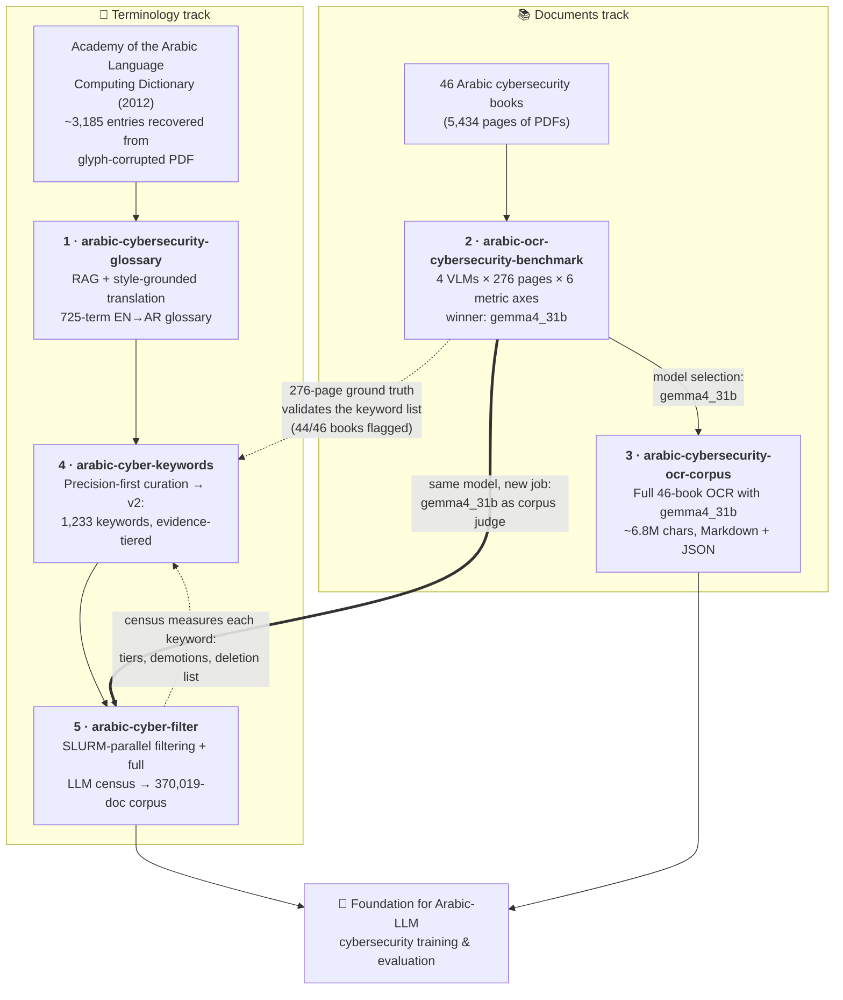

# Arabic Cybersecurity NLP — QCRI Summer Program 2026 🛡️

**The hub repository for everything I built during the Summer Program 2026: Cybersecurity at the Qatar Computing Research Institute (QCRI), HBKU.**


**Author:** Osamah Alsumaitti
**Supervisors:** Dr. Yazan Boshmaf · Dr. Mohannad Alhanahnah
**Institution:** Qatar Computing Research Institute (QCRI), Hamad Bin Khalifa University

*Last updated: 3 August 2026*

---

## The mission

Arabic is a low-resource language for cybersecurity NLP: there is no standardized Arabic security terminology, no large open Arabic cybersecurity corpus, and no established benchmark for OCR of Arabic technical documents. Over the program I built, end-to-end, the missing pieces — **a standards-grounded terminology, an evidence-tiered keyword lexicon, a validated OCR pipeline, a 46-book full-text corpus, and a 370,019-document web corpus** — each project deliberately consuming the verified output of the one before it.

The end state: **two complementary Arabic cybersecurity text corpora** (books + web), plus something most domain corpora never ship — **the labelled evidence and measurement apparatus that prove how good the corpus actually is.** Every one of the 14,653 documents in the reference corpus version carries an individual LLM verdict with a written justification, and the filter's precision is a measured number with confidence intervals, not a claim.

## The five repositories

| # | Repository | One-liner | Key deliverable |
|---|---|---|---|
| 1 | [arabic-cybersecurity-glossary](https://github.com/Alsumaitti/arabic-cybersecurity-glossary) | Standards-grounded EN→AR cybersecurity terminology via RAG over the Academy of the Arabic Language dictionary | **725-term** bilingual glossary, zero gaps |
| 2 | [arabic-ocr-cybersecurity-benchmark](https://github.com/Alsumaitti/arabic-ocr-cybersecurity-benchmark) | Head-to-head evaluation of 4 vision-language OCR models on Arabic cybersecurity books | **276-page** benchmark; **gemma4_31b** selected |
| 3 | [arabic-cybersecurity-ocr-corpus](https://github.com/Alsumaitti/arabic-cybersecurity-ocr-corpus) | Full-text OCR of 46 Arabic cybersecurity books using the benchmark winner | **5,434 pages / ~6.8M chars** in Markdown + JSON |
| 4 | [arabic-cyber-keywords](https://github.com/Alsumaitti/arabic-cyber-keywords) | Precision-first Arabic keyword lexicon — now field-tested and **evidence-tiered** | **1,233 keywords**, 640 tiered by measured reliability |
| 5 | [arabic-cyber-filter](https://github.com/Alsumaitti/arabic-cyber-filter) | Filtering FineWeb2 at scale + a full-census LLM-as-judge evaluation | **370,019-document** corpus, precision **0.715** [0.679–0.749] |

## How everything connects

This is not five isolated projects — it is one research effort in which every stage compounds on the previous one. Two tracks (terminology and documents) run in parallel, cross-validate each other, and converge on the same goal. **The newest link closes a loop:** the filter's full-corpus census measured each keyword's real-world reliability, and those measurements were imported *back* into the lexicon repo — so the terminology track is now downstream of its own downstream consumer.



The load-bearing links:

- **Glossary → Keywords.** The 725 verified term pairs are the seed vocabulary of the keyword lexicon; the "common translation" mapping (305 of 725 terms differ between classical and modern style) exists precisely because the glossary exposed the two-register problem.
- **Keywords → Filter.** The web-corpus filter does not invent its lexicon — it consumes the keyword deliverable as-is, and its LLM-as-judge layer then *measures* how well that lexicon performs at corpus scale.
- **Filter → Keywords (the feedback loop).** The full census turned the lexicon from a curated list into a **measured instrument**: every keyword now carries evidence for how often it appears in genuinely cybersecurity text on the open web. The tier files, the per-keyword audit trail, and a 74-term deletion list live in the keywords repo, so the lexicon and its evidence stay together.
- **Benchmark → OCR corpus.** The production OCR run doesn't guess a model; `gemma4_31b` was selected by a six-axis evaluation with significance testing, and the hardened OCR prompt was carried over from the benchmark's failure analysis.
- **Benchmark → Filter (the model reused).** The same `gemma4_31b` that won the OCR benchmark was later put to work as a *corpus judge* — benchmarked against frontier labels, calibrated, and used to judge documents at a scale frontier judging could never afford.
- **Cross-track validation.** The benchmark's 276-page ground truth doubled as the keyword list's validation set (44/46 books flagged, the 2 misses being a mojibake page and a nearly-all-English page).

## What I did, project by project

### 1 · Standards-grounded glossary — [arabic-cybersecurity-glossary](https://github.com/Alsumaitti/arabic-cybersecurity-glossary)

The terminology foundation. Instead of free translation, every Arabic rendering is grounded in the Academy of the Arabic Language (Cairo) *Computing Dictionary*, 4th ed.

- **Rescued the source itself:** the dictionary PDF had glyph-level font-encoding corruption; I built a normalization pipeline (deterministic de-corruption rules, wordlist + frequency disambiguation, dynamic-programming re-segmentation) that recovered **~3,185 clean entries at ~99.6% token validity**.
- **Built a RAG system** over the recovered entries (SQLite FTS5, BM25 search, context builder) and **codified the Academy's translation style** — derivation templates, fixed backbone terms, definition structure — into an explicit style guide.
- **Translated all 725 cybersecurity terms** with zero gaps: dictionary-covered terms reused verbatim, modern terms (AI/LLM, cloud) derived *by analogy to the Academy's own morphological patterns* and flagged `derived` vs `authoritative`, so every term's provenance is auditable.

### 2 · OCR model selection — [arabic-ocr-cybersecurity-benchmark](https://github.com/Alsumaitti/arabic-ocr-cybersecurity-benchmark)

A real end-to-end model-selection study on one hard corpus, before committing ~30 GPU-hours to production OCR.

- Distilled 46 books (5,434 pages) to a **276-page benchmark** — 6 most-informative pages per book, chosen by content-type heuristics plus a vision-LLM judge, exercising tables, figures, formulas, and blank pages.
- Ran **4 vision-language models on an NVIDIA H200** under identical conditions and scored them on **six axes** (CER/WER, chrF, table cell-F1, hallucination, robustness, efficiency) **plus a security-specific IOC layer** (exact-match recall/precision on CVEs, IPs, hashes) — because a reversed IP address or hash is silently, plausibly wrong.
- Verdict: **gemma4_31b** — best core-text accuracy (16.3% CER, 89.3% chrF), decisively best table structure (69.3% cell-F1), safest failure modes. Tie-broken via win-rate matrix and paired bootstrap test.
- Wrote the full report in **both English and Arabic**, a challenge log of everything that went wrong, and a Markdown-output follow-up experiment with side-by-side visual comparison — plus an openly stated validity caveat (the ground truth is model-made and lightly reviewed, not gold human transcription).

### 3 · The book corpus — [arabic-cybersecurity-ocr-corpus](https://github.com/Alsumaitti/arabic-cybersecurity-ocr-corpus)

The benchmark's conclusion, executed at scale.

- OCR'd **all 46 books — 5,434 pages, ~6.8M characters — in ~29.5 GPU-hours** on H200, one SLURM array task per book, resumable, with dual Markdown + page-level JSON output and a machine-readable manifest.
- Engineered the OCR prompt line-by-line against observed Arabic-technical-document failure modes: the **RTL/LTR directionality rule** (an IP printed `192.168.1.1` must never come back as `1.1.168.192`), strict GitHub-flavored-Markdown table serialization, anti-hallucination fences, and a `[BLANK]` sentinel.
- Built defensive decoding: dual-signal blank-page triage (text layer + pixel density), greedy decoding, and a 5-gram repetition guard with automatic `repetition_penalty` retry escalation.

### 4 · The keyword lexicon — [arabic-cyber-keywords](https://github.com/Alsumaitti/arabic-cyber-keywords)

Turning the glossary into a practical text classifier — and then letting a million records of real web text grade it.

**v1 — curated for precision.** Mapped classical → modern register (~190 systematic word-level mappings + ~100 per-term overrides: `استيثاق` → `مصادقة`, `حاجز حماية` → `جدار الحماية`), then sorted every candidate into *safe alone*, *only-in-disambiguating-combination* (`فيروس` is biology unless it's `فيروس حاسوبي`), or *rejected trap* (`التذكرة الذهبية` is a lottery, `تسلل` is a football offside). Automatic variant expansion — definite-article forms, hamza-less spellings, both registers — yielded **1,209 keywords**, validated against the OCR ground truth (44/46 books flagged).

**v2 — field-tested and evidence-tiered.** After deployment downstream, an LLM judge read **every one of the 14,653 kept records** and the verdicts were crossed against the exact keywords that matched each one. Three things came out of it:

- **The recall gap was English, not Arabic.** Mining the *missed* records showed the biggest gap was structural: security vocabulary is coined in English and enters Arabic writing untranslated — an author writes "VPN", not `الشبكة الافتراضية الخاصة`. `VPN` alone appeared in **605** missed records, then `Antivirus`, `Proxy`, `Hacker`, `Firewall`. The 24 mined terms bring the lexicon to **1,233**.
- **Keywords are not equally trustworthy, so the lexicon is now tiered** — **136 / 295 / 57 / 152** keywords across tiers 1–4, where the tier says how much *co-occurring evidence* a keyword needs before its match can be trusted. The crucial refinement is a **demotion rule**: a keyword whose solo matches are mostly false positives is demoted no matter how often it "works" — `VPN` carried 167 records to a good verdict alone but sank **414** into `not_cyber`, so it is not Tier 1. **213 keywords were demoted** this way, and **74 earned no tier at all** (every judged appearance was non-cyber) — collected as a measured, human-review deletion list.
- **The old "known edge cases" section stopped being guesswork.** Every term it had flagged as a judgment call got a verdict: `حصان طروادة` (10 good vs **163** bad → demoted), `الهندسة الاجتماعية` (demoted), `حرب المعلومات` (demoted), while `ثغرة أمنية` **held Tier 1** at 49 good vs 36. The classical-register forms carried for recall (`حاجز الحماية`: 0 vs 17) essentially never appear in a cyber sense on the modern web.

### 5 · The web corpus — [arabic-cyber-filter](https://github.com/Alsumaitti/arabic-cyber-filter)

The biggest single body of work in the program, and the one that grew most since July. It went from "a filtered corpus" to "a corpus, a measured filter, a calibrated judge, and a published dataset."

**The corpus, version by version.** Each version is a measured response to what the previous one's evaluation exposed:

| Version | What it is | Records | Measured precision (lenient) |
|---|---|---|---|
| **v1** | 1,209-keyword filter over 1M FineWeb2 records | 13,345 | ≈ 0.68 *(300-record sample)* |
| **v2** | + 24 mined English terms (1,233 keywords), recall-driven | 14,653 | **0.388** *(full census — every record judged)* |
| **v3** | Tiered acceptance rule at 1M scale | 6,041 | **0.636**, keeping 68% of genuine docs |
| **v4** | Same rule over the **full crawl** — ~70M parquet rows, 112 GB | **370,019** | **0.715** [0.679–0.749] → **~264,600 genuine** |
| **v5** | Per-record open-model judging of **all** of v4 | **277,418** | **0.8902** [0.863–0.914], retaining 92.5% of genuine content |

**📦 Published: [`Alsumaitti/arabic-cybersecurity-web`](https://huggingface.co/datasets/Alsumaitti/arabic-cybersecurity-web)** — ODC-By 1.0.

```python
from datasets import load_dataset
ds = load_dataset("Alsumaitti/arabic-cybersecurity-web", split="train")   # 279,480 docs
```

- **A full-corpus census, not a sample.** Every one of the 14,653 v2 records was individually read and labelled `cyber` / `borderline` / `not_cyber` with a written justification — **587 chunks of 25 records**, judged one chunk at a time with a commit-and-push checkpoint after each, so hitting a rolling usage limit costs at most one chunk and resumes with zero rework. **~20 sessions, ~14 hours of active work over 5 days**, at **zero marginal API cost** — against a ~USD 85–120 API-budget proposal that the resumable in-chat approach made unnecessary. Result: `cyber` 21.4% · `borderline` 17.4% · `not_cyber` 61.2%, measured exactly, no confidence intervals needed.
- **The census bought a better filter, and the improvement is measured.** The tiered acceptance rule (*keep a record iff ≥ 1 Tier-1 keyword, or ≥ 2 of tier ≤ 2, or ≥ 3 of tier ≤ 3, or ≥ 4 tiered keywords*) lifts lenient precision **0.39 → 0.64** while retaining **68%** of genuine records, and **strictly beats a blind `min ≥ 2` threshold on both precision and recall** (0.636 P / 0.677 retention vs 0.625 / 0.534) — because it trusts a lone `الأمن السيبراني` and distrusts a lone `VPN`.
- **The production run validated the prediction exactly.** Re-running the rule over the full 1M-record sample on the cluster reproduced the offline census prediction **clause for clause — 6,041 records** — despite reaching it by a completely different code path, and a text-hash join confirmed **zero records outside the judged census**.
- **Scaled 70×, and the rule got better, not worse.** v4 applied the same rule to the full FineWeb2 Arabic release (~70M rows across 25 parquet files, 112 GB), yielding **370,019 records at 0.715 precision** — higher than v3's 0.636 at 1M scale.
- **The census finished: all 370,019 documents judged individually** — 163 GPU-hours across 32 slices on two H200s, **0 unparsed, 0 duplicates**. v4's 0.7211 became **v5: 277,418 documents at 0.8902 precision**, with 25% removed. The interval reflects calibration uncertainty alone, because with every record judged there is no sampling error left.
- **The cheap path was validated against ground truth.** A stratified sample of 1,585 documents — 0.4% of the judging cost — had predicted **0.7152** [0.6793–0.7492]; the full census came in at **0.7211**. Accurate to **0.6 percentage points**. Anyone who needs a corpus-precision number can stop at the sample.
- **The strongest signal in the corpus turned out to be document length, and the filter did not use it.** Keep rate runs from **0.904** under 1k characters to **0.142** over 30k — the junk is *longer*, because long pages are forums, archives and aggregators that mention security in passing while a focused article is ~3k characters. A one-line `len(text) < 8000` cap gives **0.841** precision at **zero** LLM cost, beating the tier-rule tightening (0.816) on both axes; combined with judging it reaches **0.943**. A humbling result for weeks of keyword engineering, and the kind that only appears when you measure everything.
- **Published as a Hugging Face dataset** ([`Alsumaitti/arabic-cybersecurity-web`](https://huggingface.co/datasets/Alsumaitti/arabic-cybersecurity-web)) with four configs: **`cyber_all`** (default — 279,480 documents judged security-related, both judges merged), `corpus` (v5 alone), `census` (all 14,653 labelled documents with justifications, so anyone can recompute the numbers), and `judge_benchmark` (1,992 documents with a frontier gold label plus two open-model runs), alongside the tiered lexicon so the filter is reproducible rather than merely described.

#### The side-quest that became a result: can an open 31B model replace the frontier judge?

Frontier judging is what makes careful curation expensive, and that cost falls hardest on exactly the languages whose corpora most need curating. So I tested the substitution directly — `gemma-4-31B-it` on local H200s against the frontier census, on a **blind 1,992-record stratified set** where the gold labels never left the local machine.

**The answer is split, and the split is the interesting part.** For the **binary** accept/reject decision — the one the filter actually makes — the open model is a usable instrument: **Cohen κ 0.654**, 85.2% agreement, sensitivity 0.926, and across 664 truly-cyber documents it *never once* returned `not_cyber`. For **graded** relevance it fails, and **the failure is not fixable by prompting**: it cannot separate "about cybersecurity" from "mentions cybersecurity", and eleven worked exemplars aimed squarely at that weak class moved κ by **+0.003** and `borderline` recall by **exactly zero** — while changing 24.2% of the generated justifications, proving the exemplars were applied and simply did not help.

What makes it usable anyway is the calibration: a biased classifier with a *measured* operating point still yields unbiased population estimates. Rogan–Gladen inversion (`p_true = (p_obs − 0.295) / 0.630`) reproduced the validation set's true prevalence exactly (0.667 vs 0.667). The practical recipe is a **hybrid** — spend frontier judgments once to build the reference standard and calibrate the open model, then let the open model run at corpus scale with its bias corrected arithmetically. That is exactly what measured v4 — and then produced v5, judging all 370,019 documents for the price of GPU time the program already had.

## Timeline

| When | Milestone |
|---|---|
| **May 10, 2026** | Program start — glossary project begins: dictionary recovery + RAG pipeline |
| **Jul 8, 2026** | OCR benchmark released: 4 VLMs, 276 pages, gemma4_31b selected; Markdown follow-up experiment |
| **Jul 9, 2026** | Glossary finalized (extended edition) · keyword lexicon released (1,209 terms) · FineWeb2 filter + first LLM-as-judge evaluation (precision, recall, F1) shipped |
| **Jul 10, 2026** | Full 46-book OCR corpus published (~6.8M characters) |
| **Jul 12, 2026** | This hub repository — the connected picture |
| **Jul 14–19, 2026** | **Full-corpus census** — all 14,653 records judged individually across ~20 resumable sessions (~14 h active, 5 days, zero marginal API cost) |
| **Jul 19–27, 2026** | Evidence-tiered lexicon built from the census (136/295/57/152 tiers, 213 demotions, 74-term deletion list) and imported back into the keywords repo |
| **Jul 28, 2026** | **v4** — tiered filter scaled to the full FineWeb2 Arabic parquet release (~70M rows, 112 GB) → 370,019 records |
| **Jul 29–30, 2026** | Open-vs-frontier **judge benchmark** on H200s (κ 0.654 binary; few-shot disproved) · v4 precision measured at 0.715 · packaged as a Hugging Face dataset release |
| **Jul 31, 2026** | Batch-size and throughput measured before committing 163 GPU-hours; v5 full-corpus judging prepared |
| **Aug 3, 2026** | This README updated to the current state |

## The numbers, combined

| Metric | Value |
|---|---|
| Dictionary entries recovered from corrupted PDF | ~3,185 (≈99.6% token validity) |
| Bilingual glossary terms (zero gaps) | 725 |
| Curated Arabic keywords → field-tested lexicon | 1,209 → **1,233** (640 evidence-tiered, 74 flagged for deletion) |
| VLM OCR models benchmarked | 4 (on NVIDIA H200) |
| Benchmark pages, six metric axes + IOC layer | 276 |
| Books fully OCR'd | 46 (5,434 pages, ~6.8M characters, ~29.5 GPU-hours) |
| Web records scanned | 1,000,000 sample → **~70M** full crawl (112 GB parquet) |
| Web corpus produced | **370,019 documents**, every record with an evidence trail |
| Measured corpus precision | v4 **0.7211** (full census) → v5 **0.8902** [0.863–0.914] |
| Final corpus published | **277,418** documents, ~246,959 genuinely on-topic |
| Documents individually LLM-judged | **14,653** frontier census + **370,019** open-model census + 1,992 blind benchmark |
| Open-model judge agreement with frontier | binary **κ 0.654**, sensitivity 0.926, `cyber` recall 0.992 |
| Strongest quality signal found | document **length** — `len(text) < 8000` alone gives 0.841 precision at zero cost |
| Public dataset release | [Hugging Face](https://huggingface.co/datasets/Alsumaitti/arabic-cybersecurity-web) — `cyber_all` + `corpus` + `census` + `judge_benchmark` |

## Skills & infrastructure exercised

- **HPC at every stage:** SLURM array jobs from 100-task CPU filtering arrays to multi-GPU H200 judging waves; resumable checkpointed pipelines with `.done` markers and completeness gates; parquet row-group slicing for I/O at scale; measuring throughput and optimal batch size *before* committing 163 GPU-hours. Hard lessons throughout — heavy merges belong in the scheduler not the login node, silent PARTS/array mismatches truncate whole files, and a 5 GB JSON array is unreadable (ship JSONL).
- **Arabic NLP specifics:** whole-word matching with Unicode boundaries, diacritic stripping, hamza spelling variants, definite-article morphology, classical vs. modern translation registers, RTL/LTR bidirectional text integrity — and the structural discovery that Arabic security writing is code-switched, so an Arabic-only lexicon has a built-in recall ceiling.
- **LLMs as measured instruments, not oracles:** RAG-grounded translation with codified style; VLMs as OCR engines with failure-mode-driven prompts; LLM-as-judge with a written rubric and a full-population census; benchmarking one model against another's labels; Rogan–Gladen calibration to extract unbiased estimates from a biased-but-measured classifier; and testing whether prompting fixes a capability gap (it did not — and proving that cleanly is itself a result).
- **Research honesty:** every repo states its validity caveats openly — model-made OCR ground truth, single-corpus generalization limits, recall-estimate sensitivity, the in-sample caveat on the tiered rule — and every classification decision is auditable: provenance flags, evidence columns, per-keyword audit trails, challenge logs, and a published census anyone can use to recompute the headline numbers.

## Getting the code

The five project repositories are wired into this hub as **git submodules**, pinned to the exact commits this overview describes:

```bash
git clone --recurse-submodules https://github.com/Alsumaitti/qcri-summer-2026-cybersecurity.git
```

If you already cloned it, or want to move the pins up to each repo's latest work:

```bash
git submodule update --init          # check out the pinned commits
git submodule update --remote        # advance the pins to each repo's latest main
```

## Reading order

New to this work? Read in pipeline order: **glossary → benchmark → OCR corpus → keywords → filter**. Each README stands alone, but the "why" of each design decision usually lives one repo upstream — and for the filter, the evaluation write-up (`evaluation/RESULTS.md`) is where the real story is.

## License

The hub text is MIT. Each linked repository carries its own license and data/content notices — see the individual READMEs.

---

*Summer Program 2026: Cybersecurity — Qatar Computing Research Institute (QCRI), Hamad Bin Khalifa University.*
